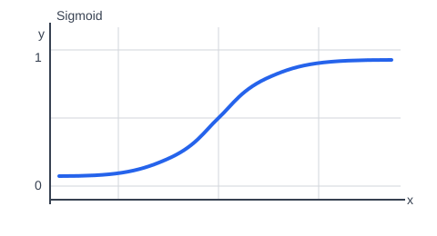
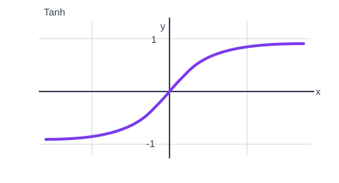
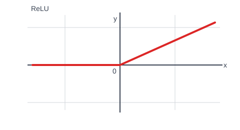
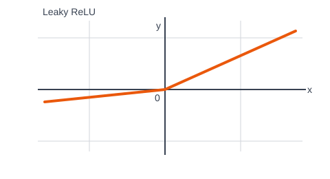
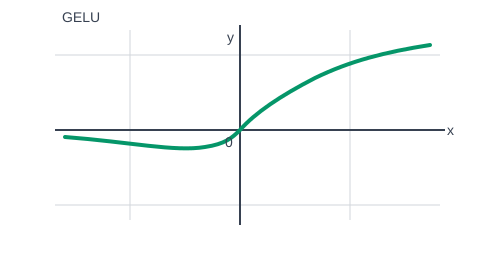

# 人工智能

用于记录人工智能基础知识与面试问答。

## AI 基础知识

### 常用激活函数

激活函数为神经网络引入非线性表达能力；没有激活函数时，多层线性层的组合仍等价于单层线性变换。

#### Sigmoid

Sigmoid 将输出压缩到 $(0,1)$，适合表示概率。它的优点是输出平滑；缺点是易在饱和区出现梯度消失、输出非零中心，且计算相对较慢。

#### Tanh

Tanh 将输出压缩到 $(-1,1)$。它的输出零中心，通常比 Sigmoid 收敛更快；但仍会在饱和区出现梯度消失。

#### ReLU

ReLU 的形式为 $\max(0,x)$。它计算简单、收敛快，能缓解梯度消失；但负半轴梯度为 0，可能出现死亡 ReLU。

#### Leaky ReLU

Leaky ReLU 在负半轴保留较小斜率，能缓解死亡 ReLU 问题；但负半轴斜率通常需要人工设定。

#### GELU

GELU 平滑地按输入大小进行门控，表达能力较好，常用于 Transformer；缺点是计算比 ReLU 更复杂。

### 模型架构中的常见层

#### 输入层（Input Layer）

输入层接收原始特征或词元等模型输入，是所有神经网络的起点。

#### 嵌入层（Embedding Layer）

嵌入层将离散类别或词元映射为稠密向量，常用于 NLP 和推荐系统。

#### 全连接层（Linear / Dense Layer）

全连接层对全部输入特征进行线性组合，常用作分类头、回归头或 MLP 的组成部分。

#### 卷积层（Convolution Layer）

卷积层利用局部感受野和权重共享提取局部模式，常用于图像、语音和时序数据。

#### 池化层（Pooling Layer）

池化层对特征图进行下采样，以降低计算量并增强局部平移鲁棒性，常用于 CNN。

#### 归一化层（BatchNorm / LayerNorm）

归一化层规范化中间特征以稳定训练过程，常见于 CNN 和 Transformer。

#### 循环层（RNN / LSTM / GRU）

循环层利用隐藏状态建模序列依赖，常用于传统序列建模。

#### 注意力层（Attention）

注意力层根据相关性动态聚合其他位置的信息，是 Transformer 的核心组件。

#### Dropout 层

Dropout 层在训练时随机失活部分神经元，以降低过拟合风险。

#### 输出层（Output Layer）

输出层将中间表示映射为预测结果，用于分类、回归或生成任务。
## 面试问答

### 一、人工智能与机器学习基础

#### 1. 什么是人工智能？

人工智能（AI）是研究如何让机器模拟、延伸或增强人类智能的学科与技术体系，常见能力包括感知、学习、推理、决策和生成。

#### 2. 机器学习、深度学习和人工智能之间有什么关系？

人工智能是总称；机器学习是实现人工智能的一类方法，使模型从数据中学习规律；深度学习是机器学习的一个分支，主要使用多层神经网络学习复杂特征。

#### 3. 监督学习、无监督学习和强化学习分别是什么？

监督学习利用带标签的数据学习输入到输出的映射；无监督学习从无标签数据中发现结构或规律；强化学习通过与环境交互，根据奖励信号学习决策策略。

### 二、数据、训练与泛化

#### 4. 什么是训练集、验证集和测试集？

训练集用于拟合模型参数；验证集用于选择模型、调整超参数和早停；测试集只用于最终评估模型泛化能力，不应参与训练或调参。

#### 5. 什么是过拟合和欠拟合？如何缓解？

过拟合指模型在训练数据上表现好、在新数据上表现差，可通过增加数据、数据增强、正则化、Dropout、早停或简化模型缓解。欠拟合指模型连训练数据规律都未学好，可增加模型能力、训练更久或改进特征。

#### 6. 怎么判断模型过拟合？有哪些处理手段？

若训练集损失持续下降、训练指标持续上升，但验证集损失开始上升或验证指标下降，且训练与验证性能差距不断扩大，通常说明过拟合。可增加或增强数据、使用 L1/L2 正则化和 Dropout、早停、降低模型复杂度，或采用交叉验证来缓解和判断。

#### 7. 什么是损失函数？

损失函数用于衡量模型预测与真实目标之间的差异，训练过程通过最小化损失来更新参数。回归常用均方误差，分类常用交叉熵损失。

#### 8. 梯度下降的基本思想是什么？

梯度下降沿着损失函数梯度的反方向迭代更新参数，使损失逐步减小。学习率决定每次更新的步长：过大可能发散，过小会导致收敛缓慢。

#### 9. 什么是梯度消失、梯度爆炸，该怎么解决？

梯度消失是反向传播时梯度在多层网络中不断变小，导致前层参数几乎无法更新；梯度爆炸则是梯度不断变大，造成参数更新不稳定甚至数值溢出。可采用合适的参数初始化、ReLU 等非饱和激活函数、Batch Normalization、残差连接和梯度裁剪；对序列模型还可使用 LSTM/GRU。

#### 10. 为什么分类问题常用交叉熵损失？

交叉熵衡量真实概率分布与预测概率分布的差异。它与 softmax 输出自然配合，在预测正确类别的概率较低时会给出较大的惩罚，便于优化。

#### 11. 什么是正则化？L1 和 L2 正则化有什么区别？

正则化是在训练目标中加入对模型复杂度的约束，以降低过拟合风险。L1 正则化倾向产生稀疏参数，可用于特征选择；L2 正则化倾向让参数整体变小，使模型更平滑稳定。

#### 12. 讲下 Batch Normalization 原理，训练阶段和推理阶段有什么不一样？

Batch Normalization（BN）对一个小批量中间特征按维度标准化，再通过可学习的缩放参数和偏移参数恢复表达能力；这能稳定特征分布、加快训练并允许使用更大学习率。训练时使用当前 mini-batch 的均值和方差，并更新全局滑动平均；推理时不再依赖当前批次，而使用训练期间累计的滑动平均均值和方差，保证单样本或不同批量下输出稳定。

#### 13. 说说常见激活函数，各自有什么缺点？

Sigmoid 将输出压缩到 0 到 1，但在饱和区梯度接近 0，且输出非零中心；Tanh 输出零中心，但同样容易饱和导致梯度消失。ReLU 计算简单、缓解梯度消失，但负半轴梯度为 0，可能出现“死亡 ReLU”。Leaky ReLU 为负半轴保留较小斜率，但斜率需人为设定；GELU 在 Transformer 中常用、平滑性较好，但计算比 ReLU 更复杂。

### 三、模型评估

#### 14. 准确率、精确率、召回率和 F1 值分别是什么？

准确率是预测正确样本的比例；精确率衡量被预测为正类的样本中有多少确为正类；召回率衡量真实正类中被正确识别的比例；F1 值是精确率与召回率的调和平均，适合类别不平衡场景下综合评价。

#### 15. 什么是混淆矩阵？

混淆矩阵统计分类结果中的真阳性、假阳性、真阴性和假阴性，是计算精确率、召回率、特异度等指标的基础。

### 四、深度学习模型与关键结构

#### 16. 什么是卷积神经网络（CNN）？

CNN 是擅长处理图像等网格结构数据的神经网络。它通过局部连接和权重共享提取空间特征，通常由卷积层、激活层、池化层和全连接层等组成。

#### 17. 说一下 CNN 和 Transformer 二者本质区别？

CNN 通过局部感受野和权重共享建模，天然具有局部性与平移不变性，更擅长捕捉邻域模式；Transformer 通过自注意力直接计算任意位置间的关系，天然具有全局建模能力。CNN 的归纳偏置更强、数据量较小时通常更高效；Transformer 对长距离依赖更灵活，但自注意力计算量会随序列长度平方增长，通常更依赖数据和算力。

#### 18. 什么是循环神经网络（RNN）？LSTM 为什么更常用？

RNN 用隐藏状态处理序列数据，但长序列训练时容易出现梯度消失或爆炸。LSTM 通过输入门、遗忘门和输出门控制信息流，能更好地保留长期依赖。

#### 19. Transformer 的核心机制是什么？

Transformer 的核心是自注意力机制：序列中每个位置可根据相关性聚合其他位置的信息。它支持并行计算，并通过位置编码保留序列顺序信息。

#### 20. 什么是注意力机制？讲讲 Self-Attention 的计算逻辑。

注意力机制会为不同输入部分分配不同权重，使模型在当前任务中更关注重要信息。Self-Attention 中，输入矩阵分别线性映射为 Query（Q）、Key（K）和 Value（V）；先计算相似度 $QK^T / \sqrt{d_k}$，再经 softmax 得到注意力权重，最后对 V 加权求和，即 $\mathrm{Attention}(Q,K,V)=\mathrm{softmax}(QK^T/\sqrt{d_k})V$。这样每个位置都能聚合序列中其他位置的信息。

#### 21. 残差结构为什么能缓解梯度消失？

残差结构将输入直接与变换后的输出相加，即 $y=F(x)+x$。反向传播时，梯度可沿恒等映射直接传回前层，不必完全经过多层非线性变换，因此更容易保持梯度并训练很深的网络；网络也只需学习残差 $F(x)$，通常更易优化。

### 五、大语言模型与应用

#### 22. 什么是大语言模型（LLM）？

大语言模型是通常基于 Transformer、在海量文本上预训练的语言模型。它通过预测下一个词或词元学习语言规律，并可经指令微调、偏好优化等步骤提升任务完成能力。

#### 23. 什么是提示词工程？

提示词工程是通过设计输入指令、上下文、示例和输出格式，引导大模型稳定完成特定任务的方法。有效提示词应明确目标、约束、输入信息和期望输出。

#### 24. 什么是 RAG？

RAG（检索增强生成）先从外部知识库检索相关内容，再将检索结果与问题一同交给大模型生成回答。它有助于补充模型未覆盖或需要更新的知识，并能提升回答可追溯性。

#### 25. 什么是模型幻觉？如何缓解？

模型幻觉是模型生成看似合理但不真实、无依据或与上下文矛盾内容的现象。可通过 RAG、限定回答依据、要求引用来源、使用工具校验、优化提示词和人工审核缓解。

### 六、模型部署与工程化

#### 26. 部署模型时需要关注哪些问题？

需关注延迟、吞吐量、显存或内存占用、成本、稳定性、数据安全和效果监控。常见优化手段包括批处理、缓存、量化、蒸馏、模型裁剪和推理服务扩缩容。