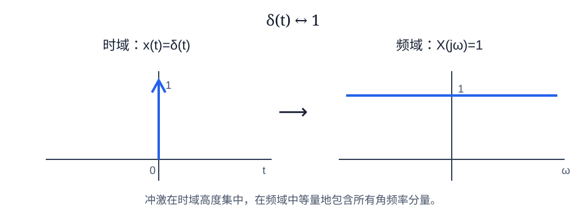
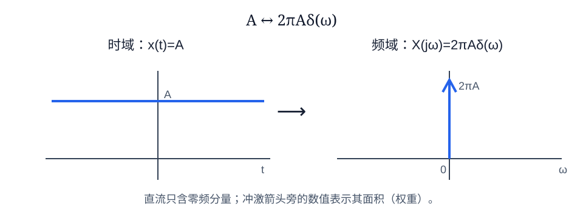
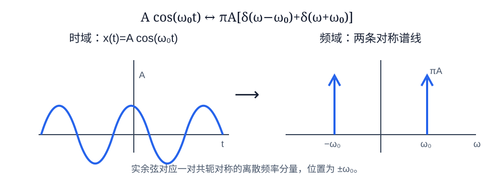
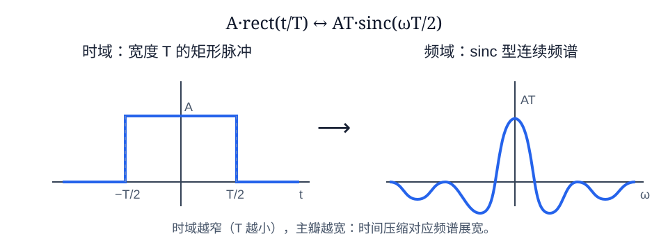
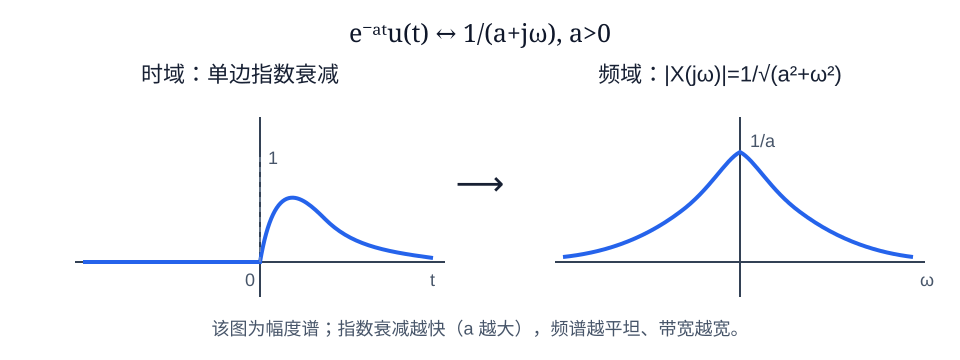

# 信号与系统

> 用于保研笔试、面试与课程复习。以确定性信号和线性时不变（LTI）系统为主线，串联时域、频域与变换域分析方法。

## 目录

- [一、信号基础](#一信号基础)
- [二、系统与 LTI 系统](#二系统与-lti-系统)
- [三、时域分析与卷积](#三时域分析与卷积)
- [四、微分方程、差分方程与状态变量](#四微分方程差分方程与状态变量)
- [五、傅里叶级数与傅里叶变换](#五傅里叶级数与傅里叶变换)
- [六、拉普拉斯变换与连续系统](#六拉普拉斯变换与连续系统)
- [七、Z 变换与离散系统](#七z-变换与离散系统)
- [八、采样与数字滤波](#八采样与数字滤波)
- [九、高频问答与易错点](#九高频问答与易错点)

---

## 一、信号基础

### 1. 信号的分类

- **连续时间信号**：自变量连续，记为 $x(t)$；**离散时间信号**：只在整数时刻有定义，记为 $x[n]$。
- **模拟信号**：时间与幅度均连续；**数字信号**：时间和幅度均离散（通常还经过量化、编码）。
- **确定性信号**：可用确定函数描述；**随机信号**：需用统计特性描述。
- **周期信号**：$x(t)=x(t+T)$，最小正周期为 $T_0$；离散信号满足 $x[n]=x[n+N]$，其中 $N$ 为最小正整数周期。
- **偶、奇信号**：$x_e(t)=\frac{x(t)+x(-t)}2$，$x_o(t)=\frac{x(t)-x(-t)}2$，且 $x=x_e+x_o$；离散情形同理。

### 2. 常用基本信号

- 单位阶跃：$u(t)=0\;(t<0)$，$u(t)=1\;(t>0)$；离散形式为 $u[n]$。
- 单位冲激：$\delta(t)$ 满足 $\int_{-\infty}^{\infty}\delta(t)\,dt=1$，抽样性质为

$$
\int_{-\infty}^{\infty}x(t)\delta(t-t_0)\,dt=x(t_0)
$$

- 阶跃与冲激：$\frac{d}{dt}u(t)=\delta(t)$，$\int_{-\infty}^{t}\delta(\tau)d\tau=u(t)$。离散时 $\delta[n]=u[n]-u[n-1]$。
- 复指数 $e^{st}=e^{(\sigma+j\omega)t}$ 可统一表示直流、指数增长/衰减与正弦信号，是 LTI 系统分析的重要特征函数。

### 3. 能量与功率

连续信号能量、平均功率分别为

$$
E=\int_{-\infty}^{\infty}|x(t)|^2dt,\qquad
P=\lim_{T\to\infty}\frac1{2T}\int_{-T}^{T}|x(t)|^2dt
$$

离散信号将积分替换为求和。$0<E<\infty$ 时为能量信号；$0<P<\infty$ 时为功率信号。非零信号不能同时是能量信号和功率信号；也可能两者皆不是。

---

## 二、系统与 LTI 系统

### 1. 系统性质

- **线性**：同时满足齐次性和可加性，即 $T\{a x_1+b x_2\}=aT\{x_1\}+bT\{x_2\}$。
- **时不变**：若 $y(t)=T\{x(t)\}$，则 $T\{x(t-t_0)\}=y(t-t_0)$。参数随时间改变的系统为时变系统。
- **因果**：任一时刻输出只依赖该时刻及过去的输入，不依赖未来输入。对 LTI 系统：连续时 $h(t)=0\;(t<0)$；离散时 $h[n]=0\;(n<0)$。
- **稳定（BIBO）**：任意有界输入产生有界输出。对 LTI 系统：

$$
\int_{-\infty}^{\infty}|h(t)|dt<\infty,qquad
\sum_{n=-\infty}^{\infty}|h[n]|<\infty
$$

- **无记忆**：当前输出仅取决于当前输入。LTI 系统中等价于 $h(t)=K\delta(t)$ 或 $h[n]=K\delta[n]$。
- **可逆**：存在逆系统，使级联输出恢复原输入；频域上要求系统函数在所讨论频率范围内不为零。

### 2. 冲激响应与系统函数

**冲激响应** $h(t)$ 或 $h[n]$ 是系统对单位冲激输入产生的零状态响应。LTI 系统完全由冲激响应刻画：任意输入可看作移位冲激的加权叠加，输出即为相应移位冲激响应的叠加。

连续系统函数 $H(s)=Y_{zs}(s)/X(s)=\mathcal L\{h(t)\}$；离散系统函数 $H(z)=Y_{zs}(z)/X(z)=\mathcal Z\{h[n]\}$。它只由系统结构和参数决定，与外部激励、初始状态无关。

### 3. 响应的两种分解

- **全响应** $=$ 零输入响应 $+$ 零状态响应。
  - 零输入响应：外加激励为零，仅由初始储能/初始状态引起。
  - 零状态响应：初始状态为零，仅由外加输入引起。
- **全响应** $=$ 自由响应 $+$ 强迫响应。
  - 自由响应来自齐次解，形式由系统特征根决定。
  - 强迫响应来自特解，形式与激励有关。

两种分法不能机械一一对应：零输入响应一定属于自由响应；零状态响应通常同时含有自由分量和强迫分量。

---

## 三、时域分析与卷积

### 1. 卷积公式与计算

LTI 系统的零状态响应为

$$
y(t)=x(t)*h(t)=\int_{-\infty}^{\infty}x(\tau)h(t-\tau)d\tau
$$

$$
y[n]=x[n]*h[n]=\sum_{k=-\infty}^{\infty}x[k]h[n-k]
$$

卷积计算四步：**翻转**其中一个函数、**平移**、找两函数的**重叠区间**、对重叠部分**相乘求积分/求和**。卷积满足交换、结合、分配律；冲激是卷积恒等元。

### 2. 阶跃响应、冲激响应与初始条件

若 $g(t)$ 是单位阶跃响应，则

$$
g(t)=\int_{-\infty}^{t}h(\tau)d\tau,\qquad h(t)=\frac{d}{dt}g(t)
$$

含有冲激或冲激导数的激励可能使响应或其导数在 $0^-$ 与 $0^+$ 之间跳变；普通有界激励通常不会使电容电压、电感电流突变。分析时应先由储能元件连续性和方程积分关系确定初始条件，再求响应。

### 3. 相关函数

互相关用于衡量两个信号在不同相对延迟下的相似程度：

$$
R_{xy}(\tau)=\int_{-\infty}^{\infty}x^*(t)y(t+\tau)dt
$$

自相关为 $R_{xx}(\tau)$。与卷积相比，相关不翻转第二个信号的时间方向（等价写法中翻转的是第一个信号），常用于同步、时延估计和检测。

---

## 四、微分方程、差分方程与状态变量

### 1. 输入输出描述法

连续 LTI 系统常由线性常系数微分方程描述：

$$
\sum_{k=0}^{N}a_k\frac{d^ky(t)}{dt^k}=\sum_{m=0}^{M}b_m\frac{d^mx(t)}{dt^m}
$$

离散 LTI 系统常由线性常系数差分方程描述：

$$
\sum_{k=0}^{N}a_k y[n-k]=\sum_{m=0}^{M}b_m x[n-m]
$$

零状态条件下可直接变换到 $s$ 域或 $z$ 域求系统函数。特征方程的根决定自然响应模式；连续因果稳定系统的极点应在左半平面，离散因果稳定系统的极点应在单位圆内。

### 2. 状态变量法

状态变量描述系统内部储能状态。连续系统标准形式为

$$
\dot{\boldsymbol{x}}(t)=A\boldsymbol{x}(t)+B\boldsymbol{u}(t),\qquad
\boldsymbol{y}(t)=C\boldsymbol{x}(t)+D\boldsymbol{u}(t)
$$

状态变量法不仅适用于 LTI 系统，也适合多输入多输出、时变与非线性系统；输入输出法更直接，但不便揭示内部结构。

---

## 五、傅里叶级数与傅里叶变换

### 1. 周期信号的傅里叶级数

周期为 $T_0$，基波角频率 $\omega_0=2\pi/T_0$。复指数形式为

$$
x(t)=\sum_{k=-\infty}^{\infty}C_ke^{jk\omega_0t},\qquad
C_k=\frac1{T_0}\int_{t_0}^{t_0+T_0}x(t)e^{-jk\omega_0t}dt
$$

周期信号频谱是离散线谱，只在基频整数倍处出现。波形越平滑，高频谐波衰减越快；存在跳变时，有限项合成在不连续点附近会产生**吉布斯现象**，其最大过冲不随项数无限增加而消失，只是更靠近跳变点。

### 2. 连续时间傅里叶变换（CTFT）

$$
X(j\omega)=\int_{-\infty}^{\infty}x(t)e^{-j\omega t}dt,qquad
x(t)=\frac1{2\pi}\int_{-\infty}^{\infty}X(j\omega)e^{j\omega t}d\omega
$$

傅里叶变换将信号分解为不同频率复指数的叠加，用于观察频率成分、带宽、滤波和系统频率响应。常用性质：

**傅里叶变换的意义**：它把非周期信号从时域映射到频域，回答“信号由哪些频率成分组成、各成分有多强和相位如何”这一问题。时域中不易分辨的振荡、带宽和噪声，在频域可直接观察；更重要的是，对 LTI 系统，时域卷积变为频域相乘，使滤波、调制及系统响应分析大幅简化。其本质是用一组复指数基函数来描述信号的频率结构。

- 时移：$x(t-t_0)\leftrightarrow e^{-j\omega t_0}X(j\omega)$。
- 微分：$\frac{dx}{dt}\leftrightarrow j\omega X(j\omega)$。
- 时域卷积：$x*h\leftrightarrow X(j\omega)H(j\omega)$。
- 时域相乘：$xy\leftrightarrow \frac1{2\pi}X*Y$。
- 尺度变换：$x(at)\leftrightarrow \frac1{|a|}X(j\omega/a)$。时域压缩会使频谱展宽。

### 3. 常见信号的傅里叶变换图示

下列图中，冲激箭头旁的数值表示冲激的面积（权重）；$\operatorname{sinc}(x)=\sin(x)/x$。它们既可用于记忆常用变换对，也可直观看到时域与频域的对应关系。

### 4. 频率响应与无失真传输

对 LTI 系统，$Y(j\omega)=H(j\omega)X(j\omega)$。无失真传输要求在信号占用频带内

$$
H(j\omega)=Ke^{-j\omega t_d}
$$

即幅频特性为常数 $|K|$，相频特性为线性相位（群延迟恒为 $t_d$）。

---

## 六、拉普拉斯变换与连续系统

### 1. 定义与收敛域

双边拉普拉斯变换为

$$
X(s)=\int_{-\infty}^{\infty}x(t)e^{-st}dt,\qquad s=\sigma+j\omega
$$

**拉普拉斯变换的意义**：它在傅里叶变换的基础上引入实指数加权 $e^{-\sigma t}$，把信号与系统从 $t$ 域推广到复频域 $s$ 平面。因此，即使普通傅里叶积分不收敛的增长、衰减或含初始条件的信号，也常能在某个收敛域内进行分析。对连续 LTI 系统，微分方程可化为关于 $s$ 的代数方程；极点、零点与 ROC 又能直接揭示系统的自然响应、因果性和稳定性。傅里叶变换是其在虚轴 $s=j\omega$ 上的特例（前提是 ROC 包含虚轴）。

收敛域（ROC）是使积分收敛的 $s$ 平面区域。**同一代数式配合不同 ROC 可对应不同的时域信号**，因此不能只写 $X(s)$ 而忽略 ROC。

- 右边信号：ROC 在最右极点右侧。
- 左边信号：ROC 在最左极点左侧。
- 双边信号：ROC 为两个极点之间的竖直带状区域。
- 因果有理系统：ROC 在最右极点右侧；稳定系统：ROC 必须包含虚轴 $j\omega$。

### 2. 系统函数、极零点与稳定性

零状态条件下 $H(s)=Y(s)/X(s)$。极点决定自然响应与稳定性，零点决定频率抑制/相消特性。对因果有理系统：

- 所有极点在左半平面 $\Rightarrow$ 稳定；
- 虚轴存在单极点通常不满足 BIBO 稳定；
- 右半平面极点 $\Rightarrow$ 不稳定。

傅里叶变换是拉普拉斯变换在 $s=j\omega$ 上的取值，前提是 ROC 包含虚轴。

### 3. 全通与最小相移

- **全通系统**：幅频特性恒为 1（或常数），主要改变相位/群延迟；连续时间实系数有理全通系统的零点与极点关于虚轴镜像。
- **最小相移系统**：在满足稳定、因果前提下，零点也位于左半平面；其逆系统可稳定因果实现，且在同等幅频特性下相位延迟最小。

---

## 七、Z 变换与离散系统

### 1. Z 变换与 ROC

$$
X(z)=\sum_{n=-\infty}^{\infty}x[n]z^{-n}
$$

Z 变换是离散时间傅里叶变换在复平面上的推广；DTFT 是 $z=e^{j\omega}$（单位圆）上的取值，前提为 ROC 包含单位圆。

- 右边序列：ROC 在最外极点外侧；因果有理系统属于这一类。
- 左边序列：ROC 在最内极点内侧。
- 稳定系统：ROC 包含单位圆；因果稳定有理系统的所有极点位于单位圆内。

### 2. DTFT、DFT 与 FFT

- **DTFT**：离散时间、连续频率，频谱关于 $2\pi$ 周期。
- **DFT**：对有限长序列在 $N$ 个等间隔频点取样，频域和时域均为有限离散序列，隐含周期延拓。
- **FFT**：计算 DFT 的快速算法，不是新的变换。直接 DFT 复杂度为 $O(N^2)$，典型基 2 FFT 为 $O(N\log_2N)$。

### 3. FIR 与 IIR

- **FIR**：冲激响应有限长，无反馈结构；天然稳定，可实现严格线性相位（系数满足对称或反对称条件），但为达到较窄过渡带往往需要较高阶数。
- **IIR**：冲激响应无限长，含反馈；可用较低阶数实现陡峭频率选择性，但需检查稳定性，通常难以严格线性相位。

线性相位意味着各频率分量具有相同群延迟，波形不产生相位失真；非线性相位会使不同频率分量延迟不同，可能导致脉冲/波形形状失真。

---

## 八、采样与数字滤波

### 1. 采样定理

若连续信号带限于 $|f|\le f_m$，以采样频率 $f_s$ 均匀采样，要由样点无失真恢复原信号，需满足

$$
f_s>2f_m
$$

$2f_m$ 称为奈奎斯特率。实际系统会留出保护带，并在采样前加入抗混叠低通滤波器。$f_s$ 不足时，各频谱副本重叠，发生混叠，后续无法完全恢复。

### 2. 数字化过程与数字信号优点

数字化过程：**采样 - 量化 - 编码**。数字信号抗干扰能力较强且噪声不易累积；便于存储、复制、加密、差错控制与大规模集成。但量化会引入量化误差，采样不足会引起混叠。

### 3. 常见滤波器

- 按通带：低通、高通、带通、带阻。
- 按实现：模拟滤波器、数字 FIR/IIR 滤波器。
- 前置滤波器常用于限制输入带宽、防止高频噪声与混叠；重构端低通滤波器用于平滑采样后频谱副本。

---

## 九、高频问答与易错点

### 1. 为什么冲激响应重要？

因为任意信号可表示为移位冲激的加权叠加；对线性时不变系统，每个移位冲激产生对应移位的冲激响应，叠加即得到输出。因此 $h$ 完全决定 LTI 系统。

### 2. 如何实际测量冲激响应？

理想冲激不可直接产生。可输入面积已知、宽度足够窄的脉冲近似冲激，或先测量阶跃响应再对其求导。脉冲越窄，近似越好；同时应保持合适的脉冲面积和信噪比，避免使被测系统饱和。

### 3. 卷积与相关的区别？

卷积用于求 LTI 系统输出，强调系统对过去输入的累积响应；相关用于衡量信号相似性与相对延时，常用于同步、匹配和检测。两者形式相近，但时间翻转与物理意义不同。

### 4. 傅里叶级数与傅里叶变换的区别？

傅里叶级数针对周期信号，得到离散谐波谱；傅里叶变换针对非周期信号，得到连续频谱。可把傅里叶变换看作周期趋于无穷大时傅里叶级数的极限。

### 5. 拉普拉斯变换、傅里叶变换与 Z 变换的关系？

拉普拉斯变换将连续信号分析从虚轴推广到 $s$ 平面；当 ROC 包含虚轴时，其在虚轴上的值就是傅里叶变换。Z 变换是离散系统对应的复平面变换；当 ROC 包含单位圆时，单位圆上的值为 DTFT。

### 6. 如何从极点判断稳定性？

必须结合 ROC。对**因果有理系统**可快速判断：连续系统所有极点在左半平面则稳定；离散系统所有极点在单位圆内则稳定。一般情形应直接检查 ROC 是否分别包含虚轴/单位圆。

### 7. 0- 与 0+ 有什么意义？

$0^-$ 表示激励接入前瞬间，$0^+$ 表示接入后瞬间，用于区分状态是否跳变。是否跳变由系统方程和奇异激励决定，不能一概认为所有状态量均连续。

---
